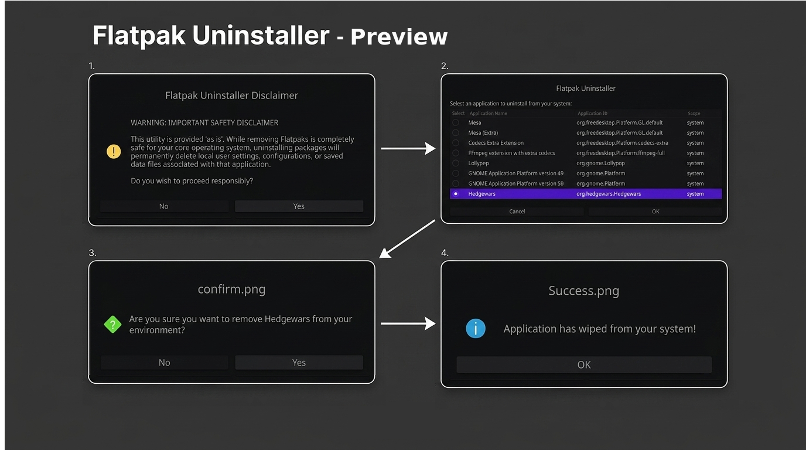

# Flatpak Uninstaller

A graphical desktop tool to easily browse and uninstall Flatpak applications on your Linux system.

---

## 🌐 Compatibility & Requirements
Compatibility: 100% Cross-Distribution (Works on MX Linux, Ubuntu, Debian, Fedora, Arch, openSUSE, etc.)

Dependencies: Before running the script, ensure you have flatpak and zenity installed via your system's package manager:

* **Debian / Ubuntu / MX Linux:** `sudo apt install flatpak zenity`
  
* **Fedora:** `sudo dnf install flatpak zenity`
  
* **Arch Linux:** `sudo pacman -S flatpak zenity`

---

## 🚀 Quick Installation
Open your terminal, clone this repository, and run the automated installation script:

~~~Bash
git clone https://github.com/cybermaxpower/Flatpak_Uninstaller.git
cd Flatpak_Uninstaller
chmod +x install.sh
./install.sh
~~~

---
## ⚖️ Warranty & Liability Disclaimer

### **NO WARRANTY (PROVIDED "AS IS")**
This software is provided completely "as is" without any warranty of any kind, either expressed or implied. 

### **LIMITATION OF LIABILITY**
* **Use at Your Own Risk:** The developer is **not liable** for any damage, data loss, or system issues that may occur on your computer from installing, running, or uninstalling software using this tool.
* **User Responsibility:** Uninstalling application containers can permanently delete local user configurations, settings, or saved files linked to those specific apps. It is your absolute responsibility to verify what you are deleting before confirming.

